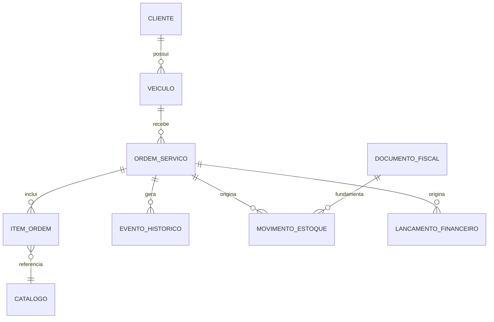
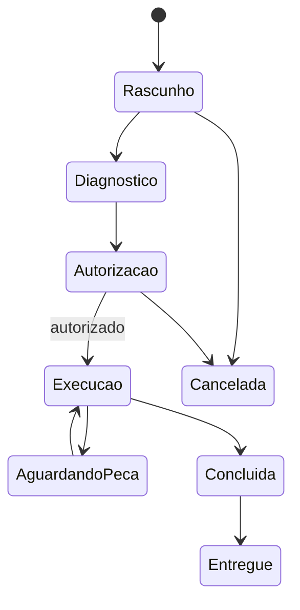

# Domínio, dados e fluxos

## 1. Centro do domínio

O veículo é o agregado de consulta mais importante, mas a ordem de serviço é o registro transacional principal de cada atendimento. O sistema deve preservar a diferença entre cadastro atual e fatos históricos.

## 2. Entidades principais

### Empresa

Representa o estabelecimento licenciado e suas preferências. Não confundir com filial; múltiplas filiais ficam fora da 1.0.

### Usuário, função e permissão

Usuários são pessoas identificáveis. Funções agrupam permissões, mas exceções individuais devem ser evitadas para não tornar a segurança incompreensível.

### Cliente

Representa o responsável atual pelo atendimento. Dados pessoais não devem ser duplicados dentro da ordem além do snapshot necessário para preservar o documento emitido.

### Veículo

Usa um núcleo comum e extensões por categoria. Identificadores precisam aceitar ausência: bicicletas podem não ter número de quadro legível; veículos antigos podem estar com dados incompletos.

### Titularidade do veículo

Registra períodos de vínculo entre cliente e veículo. A troca de proprietário não apaga o histórico técnico. A exibição de informações do proprietário anterior deve respeitar finalidade e permissão.

### Ordem de serviço

Registra o atendimento, seus estados e snapshots relevantes. Uma ordem concluída é histórica; correções posteriores serão anexadas como eventos ou revisões auditadas.

### Item de ordem

Pode ser serviço, produto, peça, taxa ou desconto permitido. Guarda descrição, quantidade, preço e situação no momento da ordem, mesmo que o catálogo mude depois.

### Inspeção e diagnóstico

O relato do cliente é uma declaração de entrada. A inspeção contém evidências observadas. O diagnóstico contém conclusão técnica. A solução descreve o executado. Esses campos não serão fundidos.

### Autorização/recusa

É um evento por item ou conjunto de itens, com canal, data, usuário, versão do orçamento e evidência. Alterar o orçamento após autorização exige nova autorização para os itens afetados.

### Garantia

Vincula serviço ou peça a uma ordem, prazo/condição e eventual retorno. Não deve prometer cobertura além do que foi formalmente definido.

### Catálogo

Reúne produtos, peças e serviços. Itens inativos continuam referenciáveis no histórico.

### Movimento de estoque

Livro operacional append-only de entradas e saídas. O saldo é consequência das movimentações confirmadas. Ajustes criam novos movimentos, nunca alteram o passado.

O custo gerencial padrão é a média ponderada móvel. Cada entrada confirmada registra quantidade e valor anteriores, valor da entrada e novo custo médio. A seleção física do item mais antigo ou do lote próximo do vencimento é uma política logística independente.

### Documento fiscal

Guarda metadados, situação, original, hash e vínculos. O conteúdo extraído é uma projeção para busca e automação; o XML original permanece como evidência recebida.

### Caixa e lançamento financeiro

Caixa representa uma sessão de operação. Lançamentos possuem origem, categoria, forma de pagamento, valor e eventual estorno. O módulo não substitui contabilidade.

Previsões e realizações são estados vinculados, não lançamentos independentes. A liquidação de uma conta converte a previsão em movimento realizado sem duplicar o fluxo de caixa.

### Fluxo de caixa

Projeção gerencial derivada de caixa, contas a receber, contas a pagar, parcelas e recorrências. Deve responder quanto há disponível, o que vence, o que está atrasado e qual será o saldo por período. Não é a Demonstração dos Fluxos de Caixa contábil.

### Evento de histórico

Projeção cronológica derivada de fatos do domínio. Sempre aponta para a entidade de origem; não é uma cópia sem rastreabilidade.

## 3. Fluxo de atendimento

1. Pesquisar cliente, placa, chassi, quadro ou telefone.
2. Cadastrar ou confirmar cliente e veículo.
3. Consultar alertas do histórico.
4. Abrir ordem e registrar relato, quilometragem e inspeção.
5. Registrar diagnóstico e preparar orçamento.
6. Obter autorização/recusa da versão apresentada.
7. Reservar ou consumir peças conforme política.
8. Executar serviços e registrar evidências.
9. Realizar testes finais e definir garantias/recomendações.
10. Concluir tecnicamente a ordem.
11. Registrar recebimento e entrega.
12. Publicar eventos na linha do tempo.

## 4. Estados da ordem

Transições adicionais exigem matriz explícita. Uma ordem entregue não retorna silenciosamente a rascunho; reabertura é evento administrativo auditado ou nova ordem de garantia.

## 5. Fluxo de compra por XML

1. Selecionar XML ou pasta.
2. Processar arquivo em área temporária segura.
3. Validar tipo, tamanho, estrutura, versão, chave e protocolo disponível.
4. Detectar duplicidade.
5. Exibir fornecedor, totais e itens.
6. Vincular cada item a produto e conversão de unidade.
7. Apresentar diferenças e alertas.
8. Confirmar lote de importação.
9. Em uma transação, persistir documento e movimentos de entrada.
10. Criar conta a pagar somente se solicitado e sem duplicar integração anterior.

Cancelar a revisão não movimenta estoque.

## 6. Fluxo de encerramento de caixa

1. Usuário informa contagem por forma de pagamento.
2. Sistema calcula valores esperados.
3. Divergências são apresentadas sem serem escondidas.
4. Usuário autorizado justifica diferenças.
5. Fechamento é confirmado e auditado.
6. Relatório do período é gerado.

## 7. Integridade e idempotência

- cada comando crítico recebe identificador único;
- repetição causada por falha de rede não gera novo movimento;
- finalização de ordem, consumo de estoque e financeiro relacionado têm fronteiras transacionais definidas;
- anexos são gravados de forma atômica ou marcados para reconciliação;
- eventos derivados podem ser reconstruídos a partir dos registros de origem;
- valores monetários usam decimal, nunca ponto flutuante binário;
- datas de negócio incluem fuso e a data local relevante;
- documentos usam snapshots para que alterações cadastrais não reescrevam o passado.

## 8. Estratégia de exclusão

Cadastros utilizados serão inativados. Exclusão física será limitada a dados sem dependências, temporários expirados ou procedimento administrativo/legal documentado. Auditoria e documentos fiscais não terão exclusão comum pela interface.

## 9. Perguntas abertas para validação com oficinas

- Em que momento a peça deve ser reservada e baixada?
- Quais estados de ordem realmente refletem o cotidiano?
- Como o cliente costuma autorizar: assinatura, mensagem, ligação ou presença?
- É necessário controlar técnico por item ou somente por ordem?
- Quais relatórios são usados diariamente?
- O caixa é único, por turno ou por usuário?
- Quais unidades e conversões de compra são mais comuns?
- Quais campos de veículo são realmente encontrados no atendimento?
