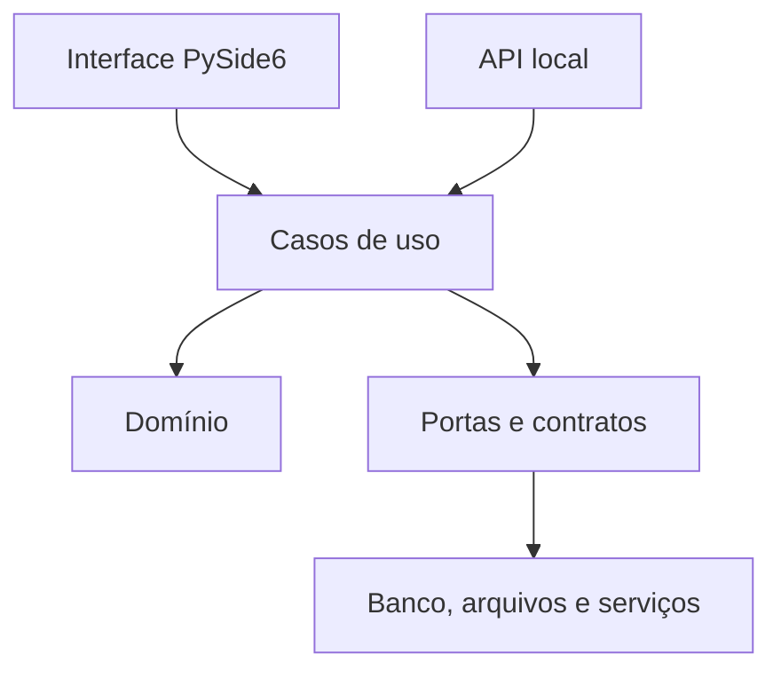

# Arquitetura e decisões técnicas

## 1. Objetivos arquiteturais

- suportar um ou vários computadores sem duplicar regras;
- manter operação sem internet;
- permitir troca de SQLite por PostgreSQL sem reescrever domínio e interface;
- proteger integridade em falhas de rede e atualização;
- produzir instalador simples para usuário não técnico;
- permitir testes sem interface gráfica;
- reduzir acoplamento fiscal e tecnológico.

## 2. Stack inicial

| Área | Escolha inicial | Observação |
| --- | --- | --- |
| Linguagem | Python | Versão exata será fixada por compatibilidade do conjunto. |
| UI | PySide6/Qt Widgets | Interface desktop; QML somente se houver benefício validado. |
| Domínio | Python puro tipado | Sem dependência direta de UI ou ORM nas regras centrais. |
| API local | FastAPI | Necessária na edição em rede; interface por contratos versionados. |
| Persistência | SQLAlchemy 2 | Repositórios e unidade de trabalho. |
| Banco individual | SQLite | Arquivo local, nunca compartilhado diretamente. |
| Banco em rede | SQLite atrás de um único serviço no piloto; PostgreSQL quando capacidade exigir | Decisão final após carga e piloto. |
| Migrações | Alembic | Migrações testadas e compatíveis com backup/restauração. |
| Empacotamento | pyside6-deploy/Nuitka | Validar tamanho, inicialização e falsos positivos. |
| Instalador | Inno Setup ou equivalente | Escolha formal após protótipo de instalação. |
| Testes | pytest | Unidade, integração, contrato e sistema. |
| Qualidade | Ruff, mypy e pre-commit | Versões fixadas. |

PySide6 é a ligação oficial do Qt para Python e oferece ferramenta de implantação para gerar executáveis. A distribuição comercial deve seguir a licença escolhida e passar por revisão de conformidade.

## 3. Camadas



### Apresentação

Telas, view models, navegação, validações de experiência e formatação. Não executa SQL nem contém regras centrais.

### Aplicação

Coordena casos de uso, autorização, transações e eventos. Exemplos: `AbrirOrdem`, `AutorizarOrcamento`, `ImportarNFe`, `FinalizarCaixa`.

### Domínio

Entidades, valores, políticas e invariantes. Deve ser testável sem banco e sem Qt.

### Portas

Interfaces para repositórios, armazenamento de anexos, relógio, geração de IDs, assinatura de atualização e outros recursos externos.

### Infraestrutura

SQLAlchemy, SQLite/PostgreSQL, sistema de arquivos, PDF, rede, logs e integrações.

## 4. Modos de execução

### Individual

UI e serviço local podem operar na mesma máquina. A conexão pode ser em processo durante protótipos, mas contratos de aplicação serão preservados. Dados ficam no disco local protegido por permissões adequadas.

### Principal da rede

Executa serviço em segundo plano, banco e backup. Escuta somente na rede necessária, autentica estações e anuncia disponibilidade de modo controlado.

### Estação

Executa UI e componentes de suporte. Não acessa diretamente arquivos de banco nem armazena credenciais de servidor em texto puro.

## 5. Banco em rede

É proibido colocar o arquivo SQLite em compartilhamento SMB para acesso direto por várias estações.

Duas configurações são aceitáveis:

1. SQLite no disco do principal, acessado apenas pelo processo servidor, adequado ao piloto de baixa concorrência.
2. PostgreSQL local no principal ou equipamento dedicado, quando concorrência, manutenção e disponibilidade justificarem.

A seleção será feita por teste e operação, não por preferência. O contrato dos repositórios deve permitir migração.

## 6. Contrato cliente-servidor

- API versionada;
- autenticação por estação e usuário;
- idempotência em comandos críticos;
- timeouts explícitos;
- erros com códigos estáveis e mensagens amigáveis;
- compatibilidade declarada entre versões;
- nenhuma regra crítica confiada somente ao cliente;
- paginação e filtros para conjuntos grandes;
- tráfego criptografado quando a distribuição e gestão de certificados forem operacionalmente seguras.

## 7. Arquivos e anexos

O banco guarda metadados; arquivos ficam em armazenamento controlado. Nomes fornecidos pelo usuário não viram caminhos diretamente. Cada anexo recebe ID interno, hash, tamanho, tipo detectado e vínculo.

Estrutura lógica:

```text
data/
  database/
  attachments/
  fiscal/
  backups/
  logs/
```

O caminho físico será escolhido por APIs do Windows, não pelo diretório de instalação.

## 8. Eventos e auditoria

Eventos de domínio atualizam linha do tempo e projeções. Auditoria é separada de log técnico:

- auditoria: ação de negócio, usuário, entidade e alteração;
- log técnico: diagnóstico, desempenho e falhas;
- evento de domínio: fato que outros módulos podem consumir.

Auditoria não deve armazenar senha, token, XML completo ou dados pessoais desnecessários.

## 9. Migrações

- cada alteração de schema possui revisão Alembic;
- migrações são testadas com cópia realista e banco novo;
- atualização cria backup consistente antes da migração;
- a aplicação valida a versão do schema;
- migração de dados complexa pode usar etapa separada e retomável;
- downgrade destrutivo não será promessa automática;
- incompatibilidade bloqueia escrita e oferece recuperação orientada.

## 10. Distribuição e cadeia de fornecimento

- dependências fixadas por arquivo de lock;
- inventário de componentes e licenças;
- build reproduzível na medida prática;
- CI isolada para teste e empacotamento;
- artefatos com checksum;
- instalador e atualizações assinados;
- segredos de assinatura fora do repositório e da máquina de desenvolvimento comum;
- verificação de vulnerabilidades antes da liberação.

## 11. Estrutura proposta do repositório

```text
oficina-desktop/
  src/oficina/
    domain/
    application/
    ports/
    infrastructure/
    presentation/
    api/
  tests/
    unit/
    integration/
    contract/
    system/
  migrations/
  installer/
  docs/
  scripts/
  pyproject.toml
  uv.lock
```

## 12. Decisões a registrar por ADR

Criar registros de decisão antes de consolidar:

- ADR-001: PySide6 e modelo de licenciamento Qt.
- ADR-002: processo local no modo individual.
- ADR-003: SQLite versus PostgreSQL na edição em rede.
- ADR-004: armazenamento e proteção de anexos.
- ADR-005: descoberta e pareamento de estações.
- ADR-006: estratégia de atualização assinada.
- ADR-007: criptografia de backup e gestão de chaves.
- ADR-008: ferramenta de instalador.

## 13. Referências técnicas oficiais

- [Qt for Python](https://doc.qt.io/qtforpython-6/)
- [Implantação com pyside6-deploy](https://doc.qt.io/qtforpython-6/deployment/deployment-pyside6-deploy.html)
- [Licenciamento do Qt for Python](https://doc.qt.io/qtforpython-6/commercial/index.html)
- [Uso apropriado do SQLite](https://sqlite.org/whentouse.html)
- [Documentação do SQLAlchemy](https://docs.sqlalchemy.org/en/20/)
- [Documentação do Alembic](https://alembic.sqlalchemy.org/en/latest/)
- [Conceitos de implantação do FastAPI](https://fastapi.tiangolo.com/deployment/concepts/)

