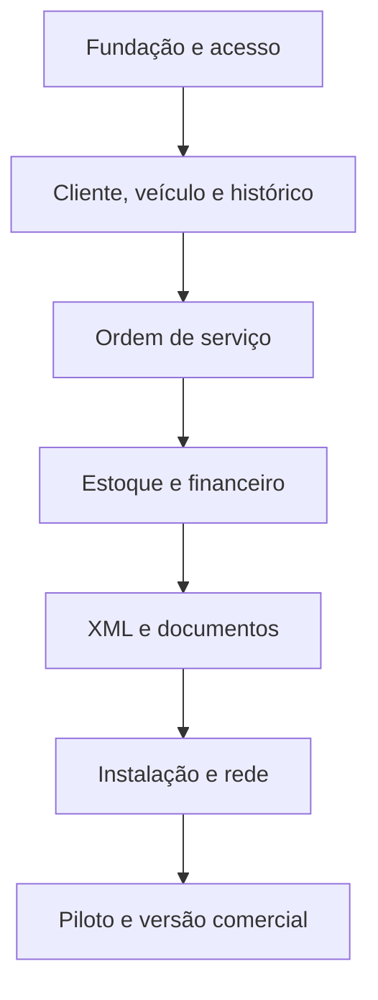

# Roadmap até a versão comercial

## 1. Estratégia

Cada versão entrega uma fatia verificável. Nenhuma versão recebe funcionalidades da etapa seguinte se os critérios de integridade da etapa atual estiverem abertos.

As versões 0.x são pré-comerciais. A versão 1.0 é a primeira autorizada para venda geral.

## 2. Sequência de evolução

| Versão | Objetivo | Entregas principais | Saída obrigatória |
| --- | --- | --- | --- |
| 0.1.0 | Fundação | repositório, camadas, CI, logging, configuração, protótipo PySide6, banco e migração | app empacotado abre em máquina limpa; ADRs iniciais. |
| 0.2.0 | Empresa e acesso | empresa, perfil, usuários, funções, permissões, auditoria-base | autorização testada fora da UI. |
| 0.3.0 | Cliente, veículo e histórico | cadastros, busca, titularidade, linha do tempo inicial | localizar e abrir histórico com dados realistas. |
| 0.4.0 | Ordem de serviço | inspeção, orçamento, autorização/recusa, estados, itens, PDF | fluxo completo sem estoque/caixa, com auditoria. |
| 0.5.0 | Estoque e fornecedores | catálogo, movimentos, custo médio móvel, inventário, reserva/consumo | concorrência, razão e reconstrução do custo aprovadas. |
| 0.6.0 | Caixa e fluxo financeiro | abertura/fechamento, contas, realizado, projetado, estorno e diário | ordem-financeiro transacional, projeção sem duplicidade e relatório diário. |
| 0.7.0 | XML de compras | importação em lote, segurança, mapeamento, conversão, entrada e conta opcional | duplicidade, rollback e amostras suportadas aprovados. |
| 0.8.0 | Documentos e relatórios | anexos, PDFs finais, CSV, garantias e recomendações | documentos consistentes e incluídos no backup. |
| 0.9.0 | Distribuição individual | instalador, assistente, backup, restauração, reparo e atualização | teste em máquina limpa e recuperação completa. |
| 0.10.0 | Edição em rede | serviço local, descoberta, pareamento, estações, compatibilidade e diagnóstico | 10 estações em teste; sem acesso direto ao banco. |
| 0.11.0 | Hardening/RC | desempenho, acessibilidade, segurança, licenças, suporte e migrações | critérios globais atendidos; início dos pilotos finais. |
| 1.0.0 | Comercial | correções do piloto, documentação pública, políticas e artefatos assinados | aprovação formal do checklist comercial. |

## 3. Detalhamento por marco

### 0.1.0 — Fundação

- arquitetura em camadas e estrutura do repositório;
- `pyproject.toml`, lock e ambientes;
- banco inicial e migração zero;
- IDs, dinheiro, datas e erros padronizados;
- janela principal e navegação protótipo;
- logs estruturados;
- CI, testes e build experimental;
- ADR de PySide6/licença, banco e empacotamento.

Não implementar regras extensas antes de provar instalação e persistência.

### 0.2.0 — Acesso

Requisitos: RF-EMP, RF-USR e base de RNF-SEG. Sem autorização central, módulos posteriores criarão dívida crítica.

### 0.3.0 — Memória do veículo

Requisitos: RF-CLI, RF-VEI e RF-HIS. Esta é a primeira demonstração do diferencial do produto e deve ser validada com mecânicos antes de avançar.

### 0.4.0 — Operação da oficina

Requisitos: RF-OS. A ordem deve funcionar sem estoque e caixa automáticos usando adaptadores temporários, para validar o fluxo sem acoplar módulos incompletos.

### 0.5.0 — Estoque

Requisitos: RF-EST. Implementar razão append-only, custo médio ponderado móvel, transações e concorrência antes da importação fiscal. PEPS permanece uma evolução arquitetural, não uma opção incompleta na 1.0.

### 0.6.0 — Caixa

Requisitos: RF-FIN. Incluir fluxo realizado e projetado com linguagem simples e sem duplicidade na liquidação. Manter caráter gerencial e não transformar a etapa em sistema contábil.

### 0.7.0 — XML

Requisitos: RF-XML e documento específico. A importação depende do catálogo e da razão de estoque estáveis.

### 0.8.0 — Documentos

Consolidar anexos, PDFs, garantias e recomendações. Executar teste de backup com volume realista.

### 0.9.0 — Produto instalável

Requisitos: RF-INS, RF-BKP e RF-UPD no modo individual. A equipe interna deve usar somente o instalador, não comandos manuais.

### 0.10.0 — Rede local

Adicionar API/serviço, estação, pareamento e diagnóstico. Migrar uma instalação individual real para rede. Medir SQLite atrás do serviço; promover PostgreSQL se os critérios técnicos exigirem.

### 0.11.0 — Release candidate

Congelar escopo P0. Foco em falhas, usabilidade, desempenho, segurança, documentação, licenças e operação.

### 1.0.0 — Venda

Somente correções aprovadas desde RC. Publicar instalador, checksums, notas, requisitos mínimos, política de suporte, privacidade, licença e procedimento de recuperação.

## 4. Dependências críticas

## 5. Definition of Done de qualquer versão

- requisitos e critérios de aceite atualizados;
- código revisado;
- testes automatizados adequados;
- migração testada;
- logs e erros revisados;
- documentação para usuário/desenvolvedor/IA atualizada;
- nenhuma credencial ou dado real no repositório;
- instalador ou artefato de teste reproduzido;
- riscos conhecidos registrados;
- demonstração em fluxo completo da versão.

## 6. Porta comercial da 1.0

### Produto

- todos os P0 implementados ou adiados por decisão formal sem quebrar proposta;
- onboarding compreendido por usuários reais;
- fluxos centrais concluídos sem suporte técnico constante;
- perfis de automóveis, motos e bicicletas verificados.

### Dados

- backup consistente e restauração em máquina limpa;
- migração desde todas as builds de piloto;
- nenhuma perda no teste de interrupção;
- exportação básica disponível.

### Segurança

- assinatura de instalador e atualização;
- permissões, auditoria e revogação verificadas;
- parser XML seguro;
- vulnerabilidades críticas e altas resolvidas ou mitigadas formalmente.

### Operação

- diagnóstico e pacote de suporte;
- procedimento de incidente e recuperação;
- canal e horário de suporte definidos;
- política de atualização e fim de suporte por versão.

### Comercial e jurídico

- nome e marca verificados;
- licença de software e contrato;
- conformidade das dependências, inclusive Qt;
- política de privacidade;
- escopo fiscal comunicado;
- preço, estações e condições de atualização claramente definidos;
- documentos revisados por profissionais competentes.

## 7. Evolução depois da 1.0

- 1.1: lembretes, comunicação e agenda, após validar demanda;
- 1.2: importação ampliada e integrações fiscais selecionadas;
- 1.3: estoque avançado, compras e indicadores;
- 1.4: acesso remoto seguro opcional;
- 2.0: múltiplas unidades, sincronização ou serviços em nuvem opcionais.

Nenhuma data será prometida antes de medir a velocidade real das versões iniciais e dos pilotos.
